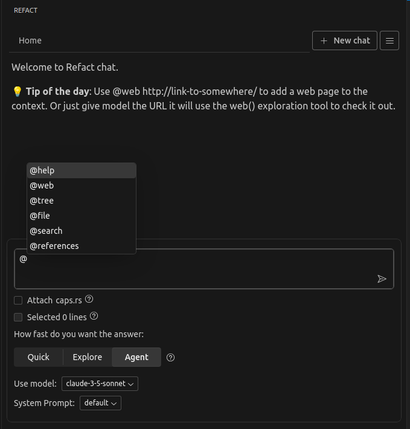

You can ask questions about your code in the integrated AI chat, and it can provide you with answers about your code or generate new code for you based on the context of your current file.

### **Context Length**
Refact analyzes the code up to a certain length to provide suggestions.
Context length depends on the plan you have chosen for your account:
- **Free**: 4096 characters
- **Pro**: 16384 characters

## @-commands

This section outlines various commands that can be used in the AI chat. Below you can find information about functionality and usage of each command.



### `@workspace`

- **Description**: Searches within VecDB for any specified query. This command allows you to search for any query within your repository/workspace.
- **Usage**:
  - Single-line Query: Append the query directly after the command, e.g., `@workspace Something definition`.
  - Multi-line Query: Type the command followed by pressing `Enter`. Subsequent lines entered will be considered part of the query, allowing for multi-line entries such as code snippets.

### `@file`

- **Description**: Attaches a file to the chat.
- **Usage**: 
  - To attach a whole file, use the command followed by the file name, e.g., `@file example.ext`.
  - To specify a particular section of a file, include the line numbers, e.g., `@file large_file.ext:42` or for a range, `@file large_file.ext:42-56`.

### `@definition`

- **Description**: Retrieves the definition of a symbol.
- **Usage**: Type `@definition` followed by the symbol name, e.g., `@definition MyClass`.

### `@references`

- **Description**: Returns references for a symbol, including usage examples.
- **Usage**: Type `@references` followed by the symbol name, e.g., `@references MyClass`.

### `@symbols-at`

- **Description**: Searches for and adds symbols near a specified line in a file to the chat context.
- **Usage**: Specify both the file and the line number, e.g., `@symbols-at some_file.ext:42`.

## Chat Initialization Options

Upon starting a new chat, several options are available that mimic the above commands:

- `Search workspace`: Equivalent to using `@workspace`. It uses the entered query to perform a search.
- `Attach current_file.ext`: Similar to the `@file` command. It attaches the file at the current cursor position (CURSOR_LINE), useful for dealing with large files.
- `Lookup symbols`: Corresponds to the `@symbols-at` command. It extracts symbols around the cursor position and searches them in the AST index.
- `Selected N lines`: Adds the currently selected lines as a snippet for analysis or modification. This is similar to embedding code within backticks ``` in the chat.

## Enabling commands

To use @-commands in the AI chat, you need to enable specific settings:
- `@workspace` - enable the `Enable embedded vecdb for search` checkbox under the `Refactai: Vecdb` section.
- `@definition`, `@file`, `@references`, `@symbols-at` - enable the `Enable syntax parsing` checkbox under the `Refactai: Ast` section.

Read more in the [Enabling RAG Documentation](https://docs.refact.ai/features/context/).