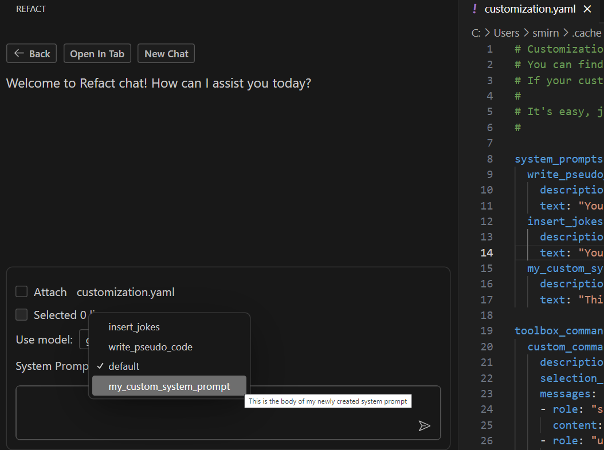

Refact.ai Toolbox is a set of functions that can be used to 
refactor, analyze, and improve your code.

The Toolbox can be accessed by pressing `F1`. It will open a modal 
window associated with a specific line of code or a block of code.

The following commands are available in the Toolbox:
- `/bugs` - Find and fix bugs in your code
- `/comment` - Comment each line
- `/edit` - Edit code. You need to write instructions after the command
- `/explain` - Explain code
- `/gen` - Create new code. You need to add a description after the command
- `/improve` - Rewrite this specific code block to improve it
- `/naming` - Improve variables, functions, classes, etc.
- `/shorter` - Make code shorter
- `/summarize` - Summarize code in one paragraph
- `/typehints` - Add type hints
- `/typos` - Find and fix typos in code


## Custom toolbox commands

You can also create your own toolbox commands. To do that, you need to press 
`F1` and type `/help` in the Refact.ai console. At the bottom, you will see a 
button called `Customize toolbox`. Press it and the `customization.yaml` 
file will open.


In the file, you will find a `toolbox_commands` section. You can add your
custom commands there.

All of the newly created commands should follow the same format:

```yaml
description: "User-defined: translate to horrible code"
    selection_needed: [1, 50]
    messages:
    - role: "system"
      content: "%DEFAULT_PROMPT%"
    - role: "user"
      content: "@file %CURRENT_FILE%:%CURSOR_LINE%\nRewrite this specific code block into a very inefficient and cryptic one, but still correct. Rename variables to misleading gibberish. Add unnecessary complexity. Make O(N) worse. Don't forget about bad formatting and random spaces.\n\n```\n%CODE_SELECTION%```\n"
```

To break it down, you need to provide the following information:
- `description` - a user-defined description of the command
- `selection_needed` - a list of line numbers that the command is valid for
- `content` - Inside the `message` for the `user` role, the exact prompt that will be used when the command is executed

Once you finish, save the file, and your custom toolbox command will be available.
When entering the `/help` command, you will see your custom command in the list of available commands.


## Customizable System Prompt

In Refact, a **system prompt** is used to maintain a standard format and clarity in communication. By default, it is set to:

```
You are a programming assistant. Use backquotes for code blocks, give links to documentation at the end of the response.
```

System prompt is used for **chat** and **toolbox** features.

To personalize your experience, you can add custom system prompts in the `customization.yaml` file:

1. Navigate to the `customization.yaml` file.
2. Add an entry under the `system_prompts` list:
```yaml
my_custom_system_prompt:
  description: "My newly created system prompt"
  text: "This is the body of my newly created system prompt"
```
3. Replace `my_custom_system_prompt` with a unique identifier for your prompt, and specify the prompt you expect to be used in the `text` field.

Your prompt will be available for selection in the dropdown for the `System Prompt` field in the chat UI.



### Example of custom system prompt
```
web_dev_prompt:
  description: "Prompt for Web Development Queries"
  text: "You are an educational assistant specializing in React, Tailwind CSS, and Next.js.
  Use backquotes for code snippets and provide context for your questions to get the most accurate assistance."
```

This custom prompt is designed to:
- Increase specificity: Mentioning specific web technologies (React, Tailwind, Next.js) helps provide more targeted assistance.
- Effective formatting: The mention of backquotes for code snippets instructs how to format the code blocks.