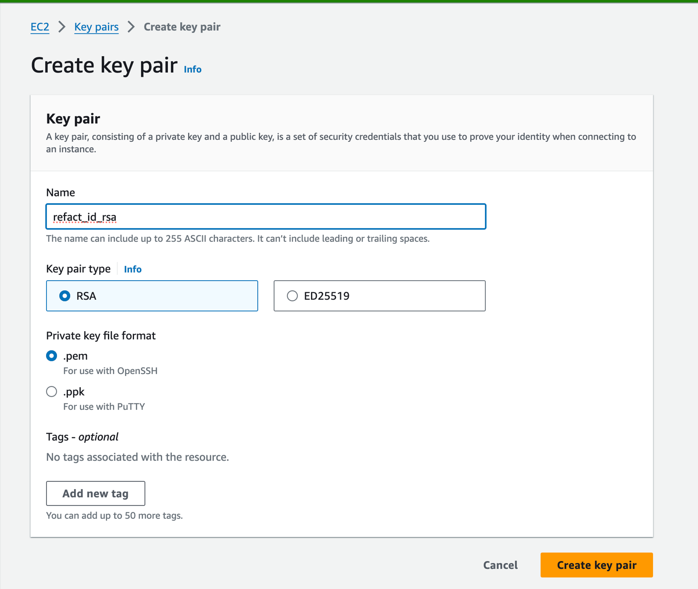

This guide provides step-by-step instructions for deploying Refact on AWS.

## Prerequisites
- An AWS account

## Log into AWS
1. Navigate to the AWS Console.
2. Log in using your credentials.
3. Locate and select the EC2 Service to access the EC2 Dashboard.


## Create a Key Pair
1. In the EC2 Dashboard, find the `Key Pairs` option in the sidebar under `Network & Security`.
2. Click on Create Key Pair.
3. Name your key pair (e.g., `refact_id_rsa`) and create it.
4. Download the key pair file (`.pem` file) to your computer. 

:::note
This file is necessary for SSH connections to your EC2 instance.
:::



## Launch an EC2 Instance
1. Return to the Dashboard and click `Launch Instance`.
2. For the AMI selection, choose an Ubuntu server image that includes NVIDIA drivers. **Note**: Ignore the AMI options that come with PyTorch and TensorFlow pre-installed. We'll use Docker to manage all necessary packages. 
    :::caution
    Make sure to select the right `Amazon Machine Image` (AMI). The correct AMI is
    `Deep Learning Base OSS Nvidia Driver GPU AMI (Ubuntu 20.04)`
    :::
3. Click `Compare` instance types. Use the filter to select a GPU machine type according to your requirements. 
4. Proceed to select your previously created key pair during instance setup.
5. Under Network settings and Storage, you can stick with the default configurations or adjust according to your needs.
6. Click `Launch Instance` to deploy your Ubuntu server.


## Access Your EC2 Instance

1. After the instance is up and running, navigate to Instances in the sidebar to find your new machine. 
2. Locate the `Public IPv4 DNS` address for your instance (e.g., `ec2-16-16-212-226.eu-north-1.compute.amazonaws.com`).
3. Open a terminal on your computer and establish an SSH connection with the command:

```bash
ssh -i "/path/to/your/refact_id_rsa.pem" ubuntu@ec2-16-16-212-226.eu-north-1.compute.amazonaws.com
```
Replace `"/path/to/your/refact_id_rsa.pem"` with the actual path to your downloaded key pair file.

## Deploy Refact

Once connected via SSH, continue to the [Refact Enterprise](https://docs.refact.ai/guides/version-specific/enterprise/) page to learn how to use Refact for teams.

## Known issues

### Incorrect AMI

**Cause**: When the host system performs a `daemon-reload` or a similar operation, it may impact containers that use systemd to manage `cgroups`.

Specifically, `daemon-reload` can trigger the reloading of any unit files that reference NVIDIA GPUs. 

As a result, the container may lose access to these GPU references. 

This issue is particularly prevalent on `Ubuntu 22.04` systems. To avoid this, use the `Deep Learning Base OSS Nvidia Driver GPU AMI (Ubuntu 20.04)` which comes with pre-installed NVIDIA components.

**Solution**: To resolve this issue, follow these steps:

1. **Install Nvidia Docker**:
    Begin by installing the Nvidia Docker on the host system. Comprehensive installation instructions are available at the Nvidia Docker Installation Guide.
2. **Modify the Docker Configuration**:
    - Open the `daemon.json` file on the host system using the command:
    ```
    sudo nano /etc/docker/daemon.json
    ```
    - Add the following parameter setting to the `daemon.json` file to specify the cgroup driver:
    ```json
    "exec-opts": ["native.cgroupdriver=cgroupfs"]
    ```
    - Ensure that the file looks like the following:
    ```json
    {
        "runtimes": {
            "nvidia": {
                "path": "nvidia-container-runtime",
                "args": []
            }
        },
        "exec-opts": ["native.cgroupdriver=cgroupfs"]
    }
    ```
    - Save the file and exit the editor.
3. **Restart Docker Service**:
    Restart the Docker service using the command:
    ```
    sudo service docker restart    
    ```