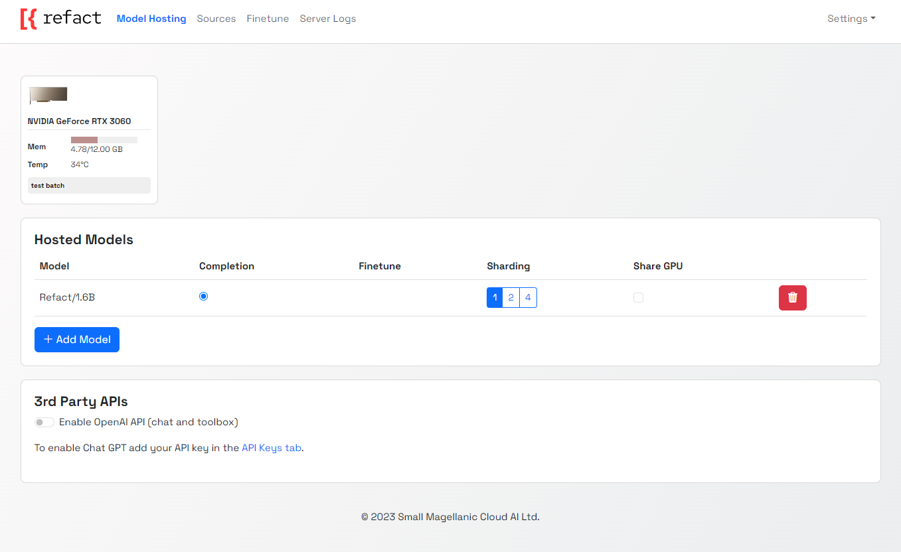

Self-hosted version of Refact is a more flexible option with additional features. It allows you to create fine-tuned models for your specific task. 

Self-hosted version is designed for developers who want to have a full control over their Refact experience.

## Prerequisites
- Docker with GPU support
- `docker-compose 1.29.2` or higher

## Installation

The easiest way to run this server is a pre-build Docker image.

Install [Docker with NVidia GPU support](https://docs.nvidia.com/datacenter/cloud-native/container-toolkit/install-guide.html#docker). On Windows you need to install WSL 2 first, [one guide to do this](https://docs.docker.com/desktop/install/windows-install).

Run docker container with following command:

```bash
docker run -d --rm -p 8008:8008 -v perm-storage:/perm_storage --gpus all smallcloud/refact_self_hosting
```
:::note
`perm-storage` is a volume that is mounted inside the container. All the configuration files, downloaded weights and logs are stored here.
:::

To upgrade the docker, delete it using `docker kill XXX` (the volume `perm-storage` will retain your data), run `docker pull smallcloud/refact_self_hosting` and run it again.

Now you can visit http://127.0.0.1:8008 to see the server Web GUI.



:::note
Add yourself to docker group to run docker without sudo (works for Linux): `commandline sudo usermod -aG docker {your user}` 
List all containers: `commandline docker ps -a` 
Start and stop existing containers (stop doesn't remove them): `commandline docker start XXX docker stop XXX` 
Shows messages from a container: `commandline docker logs -f XXX` 
Remove a container and all its data (except data inside a volume): `commandline docker rm XXX` 
Check out or delete a docker volume: `commandline docker volume inspect VVV docker volume rm VVV`
:::

### Sharding

You can choose to deploy a model to several GPUs with sharding. Select the number of GPUs that you would like to run your model on by selecting 1,2 or 3 in the sharding menu.

### Shared GPU

To run several smaller models on one GPU, select the "share GPU" option from the menu next to the selected model.

### Connecting OpenAI API

If you have an OpenAI API key, you can connect it to Refact and use GPT-series models inside Refact.

:::note
With this integration you will send your data to 3rd party providers (OpenAI). To enable OpenAI integration, you should go to settings (top right) and set and save your API key for the server usage.
:::

## Deploy a LLM


### Add one of the supported models

Each model has different supported functions (chat / completion / toolbox / fine-tuning). The list of supported models with different functions can be found [here](https://docs.refact.ai/supported-models/supported-models/)

### Preparing a Dataset for Fine-tuning

Refact fine-tuning doesn't require you to prepare your dataset in any way - it happens automatically. In the sources tab, add links to your git repos (public and private are supported), or alternatively you can give it an archive (.zip, .tar.gz or .tar.bz2). You can also upload individual files, that's especially useful if you want to use specific held-out files as a test set for fine-tuning.

After you upload your dataset, Refact will filter the data automatically.
There are 2 stages for filtering the data: 
- The first stage uses an adapted version of Git Linguist to filter out binary files, known types of generated files, files with a lot of digits in them, and some other files unsuitable for training. Duplicates are also removed at this stage.
- The second stage uses a language model, it needs to run on GPU. It filters out files that have loss too high according to the language model. High loss means the model cannot predict the text in the file very well, that happens on random data, or text that is not code at all.

You can verify what this automatic process is doing by clicking on "Accepted" and "Rejected" links. These logs will give you a reason why any specific file is rejected. The second stage will give you the loss values for each file.

### Data Scanning

During the scanning process, files uploaded to Refact as a dataset for the fine-tuning process are validated to determine their suitability.

Files rejected during the validation process are dismissed and won't be incorporated into the dataset used in the fine-tuning stage.

The potential rejection reasons are listed below:

1. **Linguist error** - Indicates that Refact couldn't open the file or the file might be corrupted.
2. **Not text** - That reason is applicable for binary files which are not suitable for the fine-tuning.
3. **File is too large** - If the file size is more than 512kb, that file will not be included in the dataset as a too-large file.
4. **Excluded by mask** - Refers to files that are manually excluded.
5. **Duplicates** - Duplicated files are rejected from the dataset.
6. **Lots of digits** - If the percentage of digits in the file exceeds a specific amount, the file will be rejected from the filtered dataset.
7. **Filter empty** - That reason is applicable when perplexity a metric assessing the model's predictive probability) cannot be calculated.

:::note
Files that didn't pass the linguist scanning could not be included manually after the filtering process.
:::

### Start Fine-Tuning

After your dataset has been filtered, you're ready to start the fine-tuning process.
First, select one of the pre-trained models for fine-tuning. 
For a list of the models that currently support fine-tuning please see [here](https://docs.refact.ai/supported-models/supported-models/).

Once you start fine-tuning, the training time will be automatically determined by the dataset size and complexity. 

The training process involves optimizing the model's weights and parameters to minimize the loss function and improve its performance.

#### Advanced Settings
You can specify custom parameters for fine-tuning in the "Advanced settings" tab.
For example, if you want to improve the model's capacity or change the schedule of learning , ie make the training longer / shorter.


- Lora R / Lora Alpha -  some hyperparameters, related to a number of optimization parameters in the fine-tuned model.

- Lora Init Scale - a hyperparameter used during the initialization of trainable weights in the fine-tuned model.

- Lora dropout - a probability at which dropout technique (regularization) is applied, used inside the `lora` trainable parameters.

- Learning Rate - a hyperparameter that determines the step size at each iteration while moving towards a minimum of the loss function. A higher learning rate can lead to faster convergence but might overshoot the optimal solution, while a smaller learning rate might converge slowly or get stuck in local minima.

- Batch Size - the number of training examples utilized in one iteration of a batch. For instance, if you have 1,000 training examples and your batch size is 100, it will take 10 iterations to complete one epoch.

- Warmup Num Steps- the initial phase of training where the learning rate gradually increases from a very small value to its originally set value. This warmup can help stabilize the training at the beginning. For example, if warmup_num_steps is 1000, for the first 1000 steps, the learning rate will increase linearly from nearly 0 to its set value.

- Weight Decay- a regularization technique used to prevent overfitting. It adds a penalty to the loss function, typically in the form of L2 regularization. This means that during training, a fraction of the weights (defined by the weight decay rate) is subtracted, pushing the weights towards zero and preventing them from growing too large.

- Train Steps: The total number of steps (or iterations) for which the model will be trained. If you have a dataset of size 1000 and you use a batch size of 100, then completing 10 steps would mean you've processed the entire dataset once (or completed one epoch).

- Learning Rate Decay Steps: In many training regimes, it's beneficial to reduce the learning rate over time, as it can help the model converge to a better solution. Learning rate decay steps define how often the learning rate should be decreased. For example, if the learning rate decay steps are set to 5000, then for every 5000 training steps, the learning rate would be decreased (multiplied) by a set factor (e.g., 0.9 or 0.95).

- Low GPU memory mode: It's used when you have a GPU with a low amount of memory. It will almost double the computation time but save a bunch of memory.

### Analyzing Fine-tuned Model

We automatically split filtered files into train and test sets and on the plot you can see 2 curves for the loss function: train and test. Checkpoints with minimal test loss are considered to be the best.

### Using a Fine-tuned Model

- Select which checkpoint from the latest fine-tune run you want to use: best from the latest or specify a custom checkpoint.  
- If you want to use the base model without fine-tuning switch the toggle to “off”.
- Once you select which fine-tuned model to use, the suggestions from it will appear automatically in your IDE. 

## Custom Inference setup

Go to plugin settings and set up a custom inference URL http://127.0.0.1:8008

### JetBrains
Settings > Tools > Refact.ai > Advanced > Inference URL

### VSCode
Extensions > Refact.ai Assistant > Extension Settings > Infurl