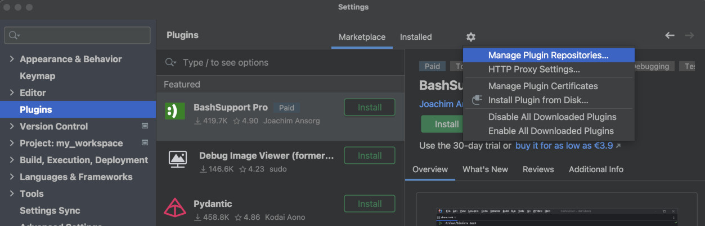

For JetBrains products, after installing the plugin from the [marketplace](https://plugins.jetbrains.com/plugin/20647-codify), press `Cmd + ,` to open the settings panel.

Find `Refact` in the list of plugins and log in to your Refact account.

You will see your account details and privacy settings.

# Early Access Program

If you feel adventurous, add Early Access Program to your Plugins settings over here:

jetbrains-early-access-program.jpg

In a small window called "Custom Plugin Repositories" add "https://plugins.jetbrains.com/plugins/eap/list",
then update the plugin.

You will have access to the EAP version of the Refact plugin. Not guaranteed to work, but we try not to publish completely
dysfunctional versions in EAP either. Try new features, report how they work in discord!
