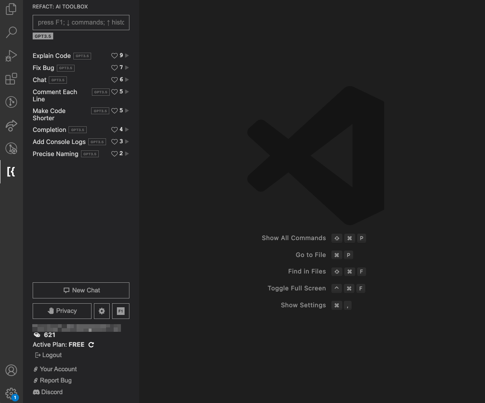
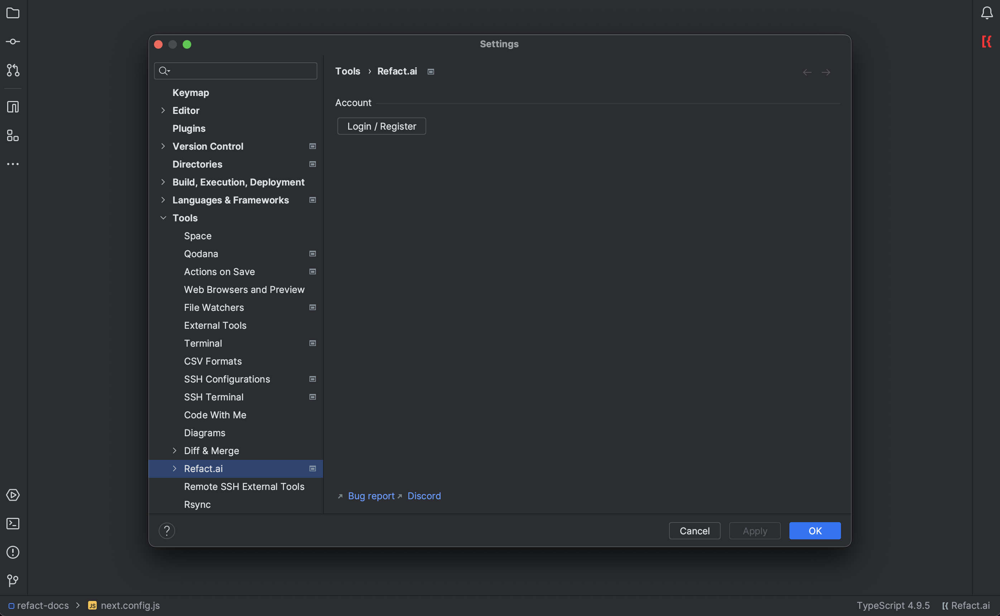
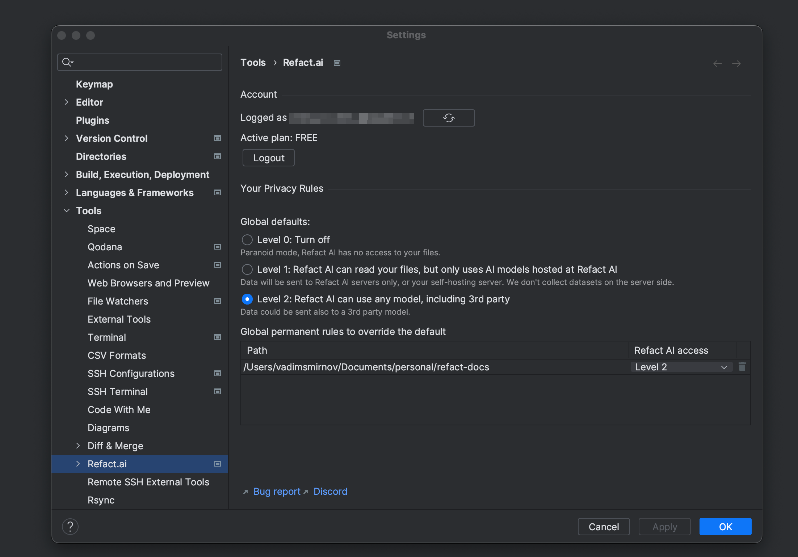

Refact plugins are available for VS Code and JetBrains IDEs.

## VS Code
After installing the plugin from the [marketplace](https://marketplace.visualstudio.com/items?itemName=smallcloud.codify), press the Refact logo to open the UI of the plugin.

At the bottom, press the `Login/Register` button to connect your local development environment with your Refact account.

After completing the connection process, you'll see the list of available commands. and your account information.

## JetBrains IDEs
For JetBrains products, after installing the plugin from the [marketplace](https://plugins.jetbrains.com/plugin/20647-codify), press ` Cmd + , ` to open the settings panel.

Find `Refact` in the list of plugins and log in to your Refact account.

You will see your account details and privacy settings.

